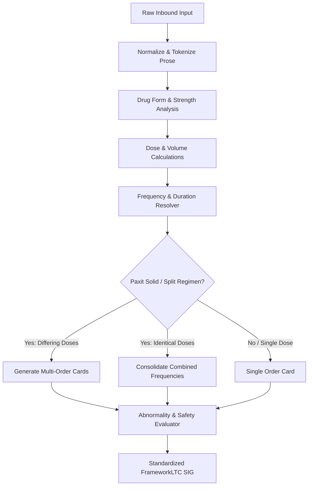

# Architectural Design Specification: Clinical SIG Engine, Citrix Storage & Technician Abnormality Detection

**Specification Date:** 2026-09-18  
**Target Repository:** [`1456319/Sig-Assist`](file:///home/deck/Sig-Assist)  
**Target Branch:** `codex/mvp-review-queue`  
**Status:** DRAFT (Under Review)

---

## 1. Executive Summary & Goals

### 1.1 Objective
Transform [`Sig-Assist`](file:///home/deck/Sig-Assist) into a production-grade pharmacy workflow accelerator for FrameworkLTC and DocuTrack environments, capable of:
1. **Algorithmic Clinical SIG Generation:** Accurately translating electronic prescriber prose into standardized FrameworkLTC SIG codes across all 38 clinical test cases specified in [`TESTS.txt`](file:///home/deck/Sig-Assist/TESTS.txt), with generalizable rule engines (not hardcoded if/else trees).
2. **PointClickCare NCPDP SCRIPT 20170715 XML Support:** Ingesting inbound E-Rx messages directly alongside freeform nurse prose.
3. **Paxit Packaging Enforcement:** Enforcing institutional pharmacy rules where oral solid multi-dose pouch medications (Paxit) cannot have split SIGs on a single Framework order, automatically generating distinct linked order cards for differing doses and titration regimens.
4. **3-Tier Clinical Abnormality Banner:** Non-blocking, high-visibility guidance highlighting uncorrected gaps, applied corrections, and potential route/formulation errors for pharmacist consultation.
5. **Technician Discrepancy & Preference Capture:** Allowing technicians to log uncaught errors and customize mnemonic preferences (e.g. `COU` vs `1T` for Coumadin 1800 administration time).
6. **Citrix Persistent Storage Adapter:** Using the Web File System Access API (`window.showDirectoryPicker`) to persist review queues, discrepancies, and preferences directly to redirected Citrix user storage (`Documents/storage/`), surviving session logouts and browser cache wipes.

---

## 2. Inbound Order Ingestion & Parsing

### 2.1 Supported Inbound Formats
The system must support two primary intake channels:
1. **NCPDP SCRIPT Standard 20170715 `NewRx` XML:**
   - **PON (Prescriber Order Number):** `<Header><PrescriberOrderNumber>` or `<PrescriberOrderNumber>`
   - **Medication / Drug Name:** `<MedicationPrescribed><DrugDescription>`
   - **Strength & Dosage Form:** Extracted from `<DrugDescription>` or parsed product attributes.
   - **Nurse Directions / Prose:** `<MedicationPrescribed><Sig><SigText>`
   - **Indication:** `<Instruction><IndicationClarifyingFreeText>`
   - **Duration / Quantity:** Extracted from `<Quantity><Value>` and `<DaysSupply>`.
2. **Technician Freeform Entry / Raw Queue Input:**
   - Single-line or multi-line technician pasting containing Drug Description, User Entry (prose), and optional Default SIG template.

### 2.2 Inbound Order Interface
```typescript
export interface InboundOrder {
  readonly id: string;
  readonly pon: string;
  readonly drugName: string;
  readonly rawProse: string;
  readonly defaultSigTemplate?: string;
  readonly indication?: string;
  readonly sourceFormat: 'ncpdp_xml' | 'manual_text';
}
```

---

## 3. Algorithmic Clinical Rules Engine

The clinical engine operates as a sequential transformation pipeline:


### 3.1 Route & Dosage Form Normalization
* **Oral Solids:**
  - Standard tablets translate to `T`, capsules translate to `C`.
  - Single-ingredient rule: Any quantity other than `"1 TABLET"` or `"1 CAPSULE"` requires the target dose in parentheses after the count:
    - *Example:* Levothyroxine 25mcg, 0.5 tab $\rightarrow$ `1/2T (12.5MCG) PO QDA/B FHYT`
    - *Example:* Tamsulosin 0.4mg, 2 cap $\rightarrow$ `2C (0.8MG) PO QHS FBPH`
* **Inhalers & Dry Powder Devices (Advair Diskus, etc.):**
  - Nurse prose stating `"take 1 capsule"` or `"inhale 1 capsule"` for inhalers automatically translates to `1P` (puff / inhalation).
  - Emits an **Applied Correction** notice.
* **Oral Liquids & Solutions:**
  - Liquid administrations use `ADM <volume>ML (<dose>) PO`.
  - *Example:* Guaiasorb DM 100-10/5ml, 10ml $\rightarrow$ `ADM 10ML PO Q6H PRN FCOU X14D`.
  - *Example:* Senna syrup 8.8mg/5ml, 10ml $\rightarrow$ `ADM 10ML (17.2MG) PO QHS X10D FCON`.
* **Bracketed Liquid Concentrates:**
  - Morphine concentrate (20mg/ml): Computes delivered dose and maps to standardized bracketed code without duplicate parentheticals:
    - *Example:* 0.5 ml $\rightarrow$ `[ROX10MG] PO Q6H FPAIN`.
* **Injectables:**
  - Formatted as `INJ <volume>ML (<dose>) SQ/IM`. Volume strictly precedes dose.
  - *Example:* Trulicity 4.5mg/0.5ml, 4.5mg $\rightarrow$ `INJ 0.5ML (4.5MG) SQ QPMDAY7 FDM`.
  - *Example:* Enoxaparin 30mg/0.3ml, 3 ml $\rightarrow$ `INJ 3ML (300MG) SQ Q12H X13D FDVTP`.
  - *Example:* Liraglutide 18mg/3ml, 1.8mg $\rightarrow$ `INJ 0.3ML (1.8MG) SQ QD FDM2`.
* **Transdermal vs. Topical:**
  - Patches: `1PA TRANSDERMALLY` (Transdermal and topical are not interchangeable).
  - Diclofenac Gel 1%:
    - Upper body site $\rightarrow$ `2GM` (`AP 2GM TPCL`).
    - Lower body / legs $\rightarrow$ `4GM` (`AP4GM TPCL` without space to prevent APAP macro expansion).
    - Unspecified site defaults to `2GM` with an **Applied Correction** notice.
    - Orders specifying both upper and lower body (e.g. *lower back, legs*) split into distinct sub-SIGs.
* **Suppositories & Alternative Routes:**
  - Rectal (`PR`), Vaginal (`PV`), Sublingual (`SL`), Otic (`AU`, `AD`, `AS`), Ophthalmic (`OU`, `OD`, `OS`).

### 3.2 APAP Warning Extension
* All products containing acetaminophen (APAP, Oxycodone-APAP, etc.) automatically append `3GM` to the end of the SIG.
* If the prescriber prose specifically mandates `"do not exceed 3g per day"` or similar limitation, the suffix changes to `3GME`.

### 3.3 Default Template Merging
* Certain medications utilize recommended default preparation templates (e.g. Miralax, Polyethylene Glycol, Kristalose).
* When a default template is present, the engine merges the user-specified quantity, route, frequency, and indication into the template structure:
  - *Example:* Kristalose 10g with default `"Dis 1 packet in 4oz water and give po qd"` + User `"Give 20 gram PO BID for constipation"` $\rightarrow$ `DIS 2 PACKETS IN 4OZ OF WATER AND GIVE PO BID FCON`.

### 3.4 Sliding Scale Insulin Logic
* All sliding scale insulin orders must begin with `CBS AC SS` (before meals) or `CBS ACHS SS` (before meals and at bedtime).
* Scale brackets must be ordered numerically in ascending order.
* Units normalization: If prescriber specifies volume (`ml`), the engine normalizes to `U` (Insulin is never dosed in ml) and flags an **Applied Correction**.
* Regular scheduled insulin (non-sliding scale) uses `UN` (e.g. `INJ 10 UN SQ QD FDM2`), reserving `U` exclusively for sliding scale character economy.

### 3.5 Administration Frequencies, Modifiers & Punctuation
* **Variations of QD:** `QD`, `QDA/B` (before breakfast), `QDP/D` (after dinner), `QAM`, `QHS`, `BID`, `BIDAMHS`, `TID`, `QID`, `Q12H`, `Q6H`, `Q4H`.
* **Day-Specific Frequencies:** `QPMDAY7` (every Sunday evening).
* **PRN & Duration Syntax Order:**
  - Scheduled orders: Duration precedes diagnosis (`1T PO Q12H X7D FCOU`).
  - PRN orders: Diagnosis precedes duration (`1T PO Q12H PRN FCOU X7D`).
* **Punctuation Rules:** All SIG tokens allow at most a single punctuation mark immediately following them, which must be followed by a space to preserve downstream FrameworkLTC tokenization.

---

## 4. Paxit Packaging Constraints & Multi-Order Cards

### 4.1 Pharmacy Packaging Rules
* **Constraint:** Paxit pouch packaging machines package oral solids (tablets/capsules) based on discrete scheduled administration times. FrameworkLTC cannot process split SIGs on a single order for Paxit items.
* **Separation Triggers:**
  1. **Differential Daily Dosing:** Different doses at different times of the day (e.g. *Take 2 tablets every morning and 1 at bedtime*) cannot be a single SIG. The engine must generate two separate orders:
     - `Order 1 of 2: 2T PO QAM`
     - `Order 2 of 2: 1T PO QHS`
  2. **Titration / Step-down Regimens:** Sequential dosing across time intervals (e.g. *Take 2 tablets daily x14 days then 1 tablet daily*) must generate two separate orders:
     - `Order 1 of 2: 2T PO QD X14D`
     - `Order 2 of 2: 1T PO QD`
* **Consolidation Permitted:** Identical doses across multiple meals (e.g. *Take 1 tablet morning AND 1 tablet lunch AND 1 tablet bedtime*) are consolidated into a single scheduled frequency:
  - `1T PO TID (BEFORE BREAKFAST, AFTER LUNCH, AND BEFORE BEDTIME)`

### 4.2 Multi-Order Workbench Presentation
When a multi-order split occurs:
* The review view renders stacked, independently verifiable order sub-cards:
  - `Card 1: Order 1 of 2 (Primary Dose)`
  - `Card 2: Order 2 of 2 (Secondary / Step-down Dose)`
* Each sub-card possesses its own draft edit field, independent review approval checkbox, and dedicated **"Copy Reviewed SIG (Order X)"** button.
* Safety rule: Clipboard copy for each card is unlocked only when that specific card has been marked as reviewed.

---

## 5. 3-Tier Abnormality Banner & Discrepancy Note Capture

### 5.1 Three-Tier Clinical Banner
When clinical anomalies or modifications are detected, a high-visibility, non-blocking banner is rendered directly above the suggested SIG:

```
┌─────────────────────────────────────────────────────────────────────────────────────────────┐
│ ⚠ One or more abnormalities were identified. Review the directions on the electronic        │
│   hardcopy carefully. The following findings were identified:                               │
│                                                                                             │
│ 1) [Sliding Scale Coverage Gap]                                                             │
│    The generated Sig does NOT contain a correction, consult RPh.                            │
│    Finding: Blood glucose range 141-180 mg/dL has no defined insulin dose                   │
│                                                                                             │
│ 2) [Diclofenac Dose Default Applied]                                                        │
│    The generated Sig CONTAINS A CORRECTION.                                                 │
│    Correction: Sig was generated with Qty/Dose = 2GM                                        │
│    Trigger: Unspecified anatomical site for topical application                             │
│                                                                                             │
│ 3) [Route / Formulation Mismatch]                                                           │
│    THIS ORDER CONTAINS A POTENTIAL ERROR. NO CORRECTION WAS APPLIED. CONSULT RPH.           │
│    Error: Suppository ordered via oral route                                                │
│    Trigger: Phrase "suppository by mouth" detected on hardcopy                             │
└─────────────────────────────────────────────────────────────────────────────────────────────┘
```

#### Banner Categories:
1. **Tier 1 - Uncorrected Gap:** Prescriber omitted critical coverage (e.g. missing sliding scale bracket). Banner states: *"The generated Sig does NOT contain a correction, consult RPh."*
2. **Tier 2 - Applied Correction:** System safely resolved an ambiguity or nurse shorthand (e.g. Diskus capsule to puff, unspecified Diclofenac gel to 2GM, volume math). Banner states: *"The generated Sig CONTAINS A CORRECTION."* with explicit `Correction` and `Trigger` fields.
3. **Tier 3 - Potential Error / Mismatch:** Critical clinical mismatch detected (e.g. suppository PO, tablet in mL without liquid formulation). Banner states: *"THIS ORDER CONTAINS A POTENTIAL ERROR. NO CORRECTION WAS APPLIED. CONSULT RPH."* with explicit `Error` and `Trigger` fields.

### 5.2 Technician Discrepancy & Uncaught Error Logging
* Each order includes an expandable panel: **"Flag Discrepancy or Uncaught Error / Preference Lead"**.
* Technicians can enter freeform observations (e.g. *Nurse ordered 10ml elixir but facility stock is 15ml unit cup*, or *Prefer COU over 1T for Coumadin*).
* Submissions are appended to `Documents/storage/discrepancies.json` with timestamp, PON, drug, input prose, calculated SIG, technician correction, and notes.

### 5.3 Technician Preference Layer
* Provides personal and site-wide macro overrides stored in `Documents/storage/preferences.json`.
* Example: Mapping Coumadin / Warfarin oral solid orders to `COU` instead of `1T` so FrameworkLTC automatically applies the facility's 1800 administration time schedule.

---

## 6. Citrix Storage Architecture (`Documents/storage`)

### 6.1 Storage Strategy
In Citrix XenApp / Remote Desktop environments, browser local cache is volatile and subject to per-session wipes. Technicians have access to persistent redirected user storage at:
`file://ctxfilebalt01v.pharmacy.local/Prod_Citrix_Redirect/david.williams/Documents/storage/`

### 6.2 Implementation Architecture (`src/lib/citrixStorage.ts`)
1. **File System Access API:**
   - Uses `window.showDirectoryPicker()` to request access to the technician's `Documents/storage/` directory once.
   - The directory handle is stored in IndexedDB using `idb-keyval`.
   - On application startup, the app checks for existing directory handles and calls `queryPermission({ mode: 'readwrite' })`. If needed, `requestPermission()` is invoked with a single user click.
2. **Fallback Mechanism:**
   - If the browser does not support `showDirectoryPicker` or permission is denied, the application falls back to IndexedDB/`localStorage`.
   - A persistent status badge indicates: *"Operating in session cache. Connect Citrix storage folder to persist across logouts."*
   - Manual **Export JSON Backup** and **Import JSON Backup** buttons are always available.
3. **Atomic Debounced Serialization:**
   - Reads and writes are debounced (500ms) to avoid saturating network file shares.
   - Writes write to a temporary handle before replacing to prevent file corruption during transient Citrix network disconnects.

### 6.3 Storage Schemas
All files are saved as UTF-8 indented JSON:
* [`queue.json`](file:///home/deck/Sig-Assist/Documents/storage/queue.json):
  ```typescript
  export interface StoredQueueFile {
    readonly version: 1;
    readonly lastModified: string;
    readonly orders: Array<{
      readonly id: string;
      readonly pon: string;
      readonly drugName: string;
      readonly rawProse: string;
      readonly defaultSigTemplate?: string;
      readonly subOrders: Array<{
        readonly id: string;
        readonly suggestedSig: string;
        readonly draftSig: string;
        readonly isReviewed: boolean;
        readonly abnormalities: AbnormalityFinding[];
      }>;
      readonly status: 'pending' | 'completed' | 'skipped';
      readonly reviewedAt?: string;
    }>;
  }
  ```
* [`discrepancies.json`](file:///home/deck/Sig-Assist/Documents/storage/discrepancies.json):
  ```typescript
  export interface DiscrepancyReport {
    readonly id: string;
    readonly timestamp: string;
    readonly pon: string;
    readonly drugName: string;
    readonly rawProse: string;
    readonly generatedSig: string;
    readonly technicianSig: string;
    readonly notes: string;
    readonly flaggedForRph: boolean;
  }
  ```
* [`preferences.json`](file:///home/deck/Sig-Assist/Documents/storage/preferences.json):
  ```typescript
  export interface TechnicianPreferences {
    readonly version: 1;
    readonly drugCodeOverrides: Record<string, string>; // e.g. { "WARFARIN": "COU", "COUMADIN": "COU" }
    readonly defaultAdminTimes: Record<string, string>;
  }
  ```

---

## 7. Keyboard Shortcuts & Workflow Ergonomics

For high-volume pharmacy order entry:
* `Alt + A`: Toggle review approval status on the active order card.
* `Alt + C`: Copy the reviewed uppercase SIG to clipboard (enforcing review guard).
* `Alt + R`: Reset current draft to the calculated suggestion.
* `Alt + N`: Focus the discrepancy note capture area.
* `Alt + Right` / `Alt + Left`: Navigate to next / previous queue order.

---

## 8. Verification & Test Strategy

### 8.1 Automated Unit Tests (Vitest)
A dedicated test suite [`tests/clinicalEngine.test.ts`](file:///home/deck/Sig-Assist/tests/clinicalEngine.test.ts) will validate every case in [`TESTS.txt`](file:///home/deck/Sig-Assist/TESTS.txt):
1. **Case 1 (Protonix):** `1T PO QD FGERD`
2. **Case 2 (Miralax):** `1PKT PO QD FSU`
3. **Case 3 (Humalog Sliding Scale):** `CBS AC SS <70=HYPOGLYCEMIC PROTOCOL;181-200=1U;201-250=2U;251-300=3U;301-350=4U;>350=5U`
4. **Case 4 (Trulicity Injection):** `INJ 0.5ML (4.5MG) SQ QPMDAY7 FDM`
5. **Case 5 (Tamsulosin QD variant):** `1C PO QDP/D IN THE EVENING FBPH`
6. **Case 6 (Levothyroxine Half-tablet):** `1/2T (12.5MCG) PO QDA/B FHYT`
7. **Cases 7-38:** All liquid volumes, injectables, APAP 3GM/3GME rules, Diclofenac 2GM/4GM site logic, Paxit split generation, and morphine bracketed concentrates.
8. **Inbound XML Tests:** Parsing PointClickCare NCPDP SCRIPT 20170715 `NewRx` sample XML.
9. **Citrix Storage Tests:** Testing file system adapter fallback, serialization, and error recovery.

### 8.2 Clinical Safety Invariants
* **Zero PHI Emission:** No patient, prescriber, or facility identifiers logged in console, git commits, or persistent disk files.
* **Clipboard Locking:** Clipboard copy is strictly prevented until explicit review acknowledgment has occurred.
* **Uppercase Standard:** Copied SIG is strictly guaranteed uppercase.

---

## 9. Review Checklist & Self-Assessment

- [x] **No Placeholders or TODO markers:** All structures, schemas, and clinical rules are fully specified.
- [x] **Internal Consistency:** Paxit multi-order generation, 3-tier abnormality banners, and Citrix file storage schemas align across all sections.
- [x] **Scope:** Solves the 38 clinical test cases and production Citrix environment requirements without modifying unrequested files.
- [x] **Ambiguity Scan:** Clear interfaces, exact banner phrasing, and explicit fallback pathways defined for implementation.
